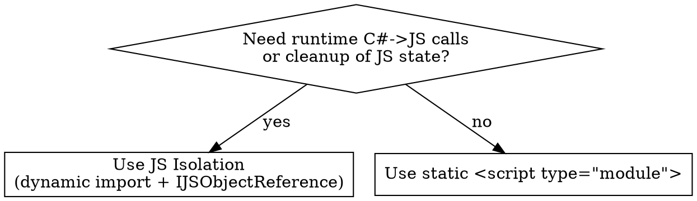

# Blazor JS Interop

## Overview

Blazor talks to JavaScript through `IJSRuntime`. The hard parts are **timing** (prerender), **placement** (where the `.js` lives), and **disposal** (everything must be released). Pick the right load style, follow the lifecycle, dispose everything. **Violating the letter of these rules is violating the spirit.**

This skill is project-specific to a .NET 10 Blazor Web App with split Server (`BlazorApp-Context`) and Client/WASM (`BlazorApp-Context.Client`) projects. The Counter page uses `@rendermode InteractiveAuto`.

## When to use

- Component needs `navigator.clipboard`, `localStorage`, focus/scroll, a chart lib, a JS editor, an Observer
- A JS event must call back into C#
- You see `IJSRuntime`, `InvokeAsync`, `[JSInvokable]`, `window.*`, or "from JS call C#"

**When NOT to use:** pure C# work, no browser APIs, no JS libraries.

## Decision: which load style?



**Quick reference:**

| Pattern | Use when | Disposal |
|---|---|---|
| Static `<script type="module" src="@Assets[...]">` | JS runs once at parse; hooks DOM by id; no runtime C#→JS calls | None — runs once |
| JS Isolation (`InvokeAsync<IJSObjectReference>("import", ...)`) | Component calls JS after first render, holds per-instance state, or needs cleanup | `IAsyncDisposable` on the component, `await _module.DisposeAsync()` |

**If the component needs JS → C# callbacks, you need JS Isolation.** Static `<script>` cannot hold a `DotNetObjectReference` tied to a component instance.

## File placement (no asking)

Co-locate the `.razor.js` next to its `.razor`, **in the same project**:

- `BlazorApp-Context.Client/Pages/Counter.razor` → `BlazorApp-Context.Client/Pages/Counter.razor.js`
- `BlazorApp-Context/Components/Pages/Foo.razor` → `BlazorApp-Context/Components/Pages/Foo.razor.js`
- `BlazorApp-Context/Components/Layout/Bar.razor` → `BlazorApp-Context/Components/Layout/Bar.razor.js`

**Forbidden:**
- `BlazorApp-Context/wwwroot/js/*.js` for component JS
- `BlazorApp-Context.Client/wwwroot/js/*.js` for component JS
- Any `window.foo = {...}` global helper
- Adding a new `<script src="...">` line to `App.razor`

The CLAUDE.md "ask before creating components" rule does **not** apply to `.razor.js` files — placement is mechanical (follow the `.razor`).

## Pattern A — Static `<script type="module">`

For self-contained widgets that hook the DOM once at parse time. Matches the existing `ReconnectModal.razor`.

```razor
@* MyBanner.razor *@
<script type="module" src="@Assets["Components/Layout/MyBanner.razor.js"]"></script>

<div id="my-banner">...</div>
```

```js
// MyBanner.razor.js
const banner = document.getElementById("my-banner");
banner.addEventListener("click", () => banner.classList.toggle("expanded"));
```

No C# code needed. No disposal. No interop calls. If you find yourself reaching for `IJSRuntime`, switch to Pattern B.

## Pattern B — JS Isolation (full lifecycle)

Use for runtime calls in either direction. This is the canonical pattern; copy it verbatim and adapt.

```razor
@page "/counter"
@rendermode InteractiveAuto
@implements IAsyncDisposable
@inject IJSRuntime JS

<button @onclick="DoIt">Do it</button>
<p>@status</p>

@code {
    private IJSObjectReference? _module;
    private DotNetObjectReference<Counter>? _dotNetRef;
    private string? status;

    protected override async Task OnAfterRenderAsync(bool firstRender)
    {
        if (!firstRender) return;

        _dotNetRef = DotNetObjectReference.Create(this);
        _module = await JS.InvokeAsync<IJSObjectReference>(
            "import", "./Pages/Counter.razor.js");
        await _module.InvokeVoidAsync("init", _dotNetRef);
    }

    private async Task DoIt()
    {
        if (_module is null) return;
        await _module.InvokeVoidAsync("run", "payload");
    }

    [JSInvokable]
    public void OnJsResult(bool ok)
    {
        status = ok ? "OK" : "Failed";
        StateHasChanged();
    }

    public async ValueTask DisposeAsync()
    {
        if (_module is not null)
        {
            try { await _module.DisposeAsync(); }
            catch (JSDisconnectedException) { }
        }
        _dotNetRef?.Dispose();
    }
}
```

```js
// Counter.razor.js
let dotNet;

export function init(dotNetRef) {
    dotNet = dotNetRef;
}

export async function run(payload) {
    let ok = false;
    try {
        // ... do JS work ...
        ok = true;
    } catch { ok = false; }
    if (dotNet) await dotNet.invokeMethodAsync("OnJsResult", ok);
}
```

The import path is **relative to the app base**, mirroring the `.razor.js` location: `./Pages/Counter.razor.js`, `./Components/Layout/Foo.razor.js`, etc.

## The six rules

1. **Never call `IJSRuntime` during prerender or initialization.** Not in the constructor, not in `OnInitializedAsync`, not in parameter setters. Only in `OnAfterRenderAsync(bool firstRender)`, gated by `if (firstRender)` for one-time setup.

2. **Import the module once, store the `IJSObjectReference`.** Re-importing on every render is a bug. Path is relative to app base: `"./Pages/Counter.razor.js"`.

3. **Implement `IAsyncDisposable`. Dispose the module.** Wrap `await _module.DisposeAsync()` in `try/catch (JSDisconnectedException)` — that's the legitimate "circuit gone" case. No other catches; other exceptions bubble. Do **not** use plain `IDisposable` — `DisposeAsync` is required for `IJSObjectReference`.

4. **`DotNetObjectReference` for JS → C# callbacks, and dispose it too.** `[JSInvokable]` method must be `public`. Call `StateHasChanged()` if the callback mutates state — JS callbacks do not auto-trigger re-render.

5. **InteractiveAuto/Server mode: always `await`.** All `InvokeAsync` calls go async over SignalR in Server mode. Never `.Result` or `.Wait()`. Don't assume `IJSInProcessRuntime` — InteractiveAuto components may run on Server.

6. **Co-locate `.razor.js` next to its `.razor` in the same project.** No `wwwroot/js/`. No globals. No `<script>` in `App.razor`. Mechanical placement, no asking.

## Common mistakes

| Symptom | Fix |
|---|---|
| `InvalidOperationException: JavaScript interop calls cannot be issued at this time...` | Move call to `OnAfterRenderAsync(firstRender: true)` |
| `JSDisconnectedException` thrown from `DisposeAsync` | Wrap `_module.DisposeAsync()` in `try/catch (JSDisconnectedException)` |
| JS callback updates field but UI doesn't refresh | Add `StateHasChanged()` to the `[JSInvokable]` method |
| Module re-imports on every render | Add `if (!firstRender) return;` at the top of `OnAfterRenderAsync` |
| `[JSInvokable]` "not found" from JS | Method must be `public` |
| Used `window.foo()` global | Move to a `.razor.js` module; remove the global |
| Used `IDisposable` instead of `IAsyncDisposable` | `IJSObjectReference` needs `DisposeAsync`. Switch. |

## Red flags — STOP

These thoughts mean you're rationalizing your way out of a rule. Stop and apply the rule.

| Rationalization | Reality |
|---|---|
| "Just one call, `window.*` is fine" | No. Use a `.razor.js` module. Always. |
| "A single small global helper is simpler than module isolation" | This is the exact rationalization the skill was built to block. Use the module. |
| "The script in `App.razor` matches the rest of the app (Bootstrap, blazor.web.js)" | Those are framework/vendor scripts. Component JS goes in `.razor.js`. |
| "Adds disposal complexity, I'll skip module isolation" | Disposal is the point. Always JS isolation when there are runtime calls or callbacks. |
| "I'll skip dispose for now" | `JSDisconnectedException` floods logs; `DotNetObjectReference` leaks. Always dispose. |
| "`OnInitialized` works since the component is interactive" | Prerender still runs. Always `OnAfterRenderAsync`. |
| "It's WASM-only, sync is fine" | InteractiveAuto might run on Server. Always `await`. |
| "wwwroot/js/ shared is cleaner because the helper is small" | The user chose inline-only per component. No shared helpers. |
| "I'll skip browser verification, the build passes" | `dotnet build` doesn't catch JS errors. Verify in the browser. |
| "The server project hosts App.razor so JS belongs there" | JS belongs next to the component that uses it, in that component's project. |

## Verification gate (required)

Before declaring the interop task complete, you MUST invoke the `verify-blazor-page` skill on the affected route. JS errors surface only in the browser console; `dotnet build` does not catch them. If the console shows errors or the page doesn't render the expected behavior, the task is not done — fix and re-verify.

## Checklist before completion

- [ ] `.razor.js` is co-located with the `.razor` in the same project
- [ ] No `wwwroot/js/`, no `window.*` global, no new `<script>` in `App.razor`
- [ ] `OnAfterRenderAsync(bool firstRender)` with `if (!firstRender) return;` (or `if (firstRender) { ... }`)
- [ ] `IJSObjectReference` stored in a field
- [ ] `@implements IAsyncDisposable` (not `IDisposable`)
- [ ] `DisposeAsync` wraps `_module.DisposeAsync()` in `try/catch (JSDisconnectedException)`
- [ ] `DotNetObjectReference` (if used) is disposed
- [ ] `[JSInvokable]` methods are `public` and call `StateHasChanged()` if they mutate state
- [ ] All `InvokeAsync` calls are `await`ed — no `.Result`, no `.Wait()`
- [ ] `verify-blazor-page` invoked on the affected route; console is clean
